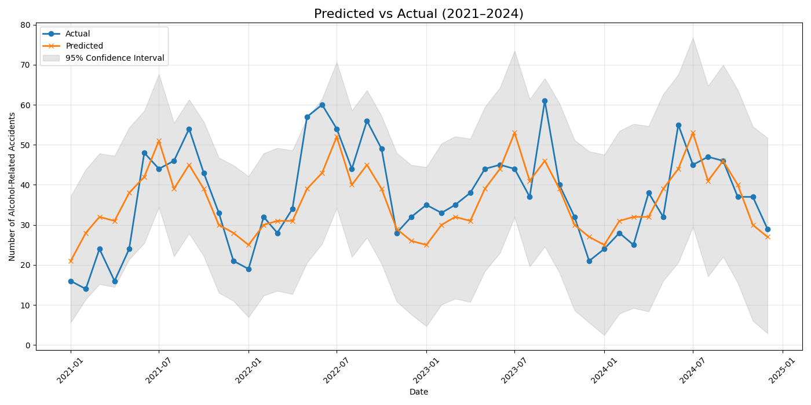

# Evaluation — SARIMA Model (2021–2024 Test Set)

This folder contains the evaluation artifacts and instructions for the SARIMA forecasting model used to predict monthly counts of alcohol-related accidents for the 2021–2024 test period.

## Summary of results

Model: SARIMA  
Test period: 2021–2024

Performance metrics (test set)
- Mean Absolute Error (MAE): **6.44**
- Mean Squared Error (MSE): **60.98**
- Root Mean Squared Error (RMSE): **7.81**
- R² Score: **0.583**
- Mean Absolute Percentage Error (MAPE): **19.95%**

Visual summary
- The main visualization in this folder (Predicted vs Actual plot) shows:
  - Observed (actual) monthly counts vs predicted values for 2021–2024.
  - A 95% confidence interval band around the predictions (shaded area).
  - The plot highlights where the model under- or over-predicts and how uncertainty varies over time.

## Files in this directory

- `Model_Performance.png` — the main figure showing actual vs predicted series with 95% CI.
- `Performance_evaluation.py` — script to run the evaluation pipeline.

## How to reproduce the evaluation
- Run Performance_evaluation.py
- 
Prerequisites
- Python 3.8+
- pip install -r requirements.txt
  

