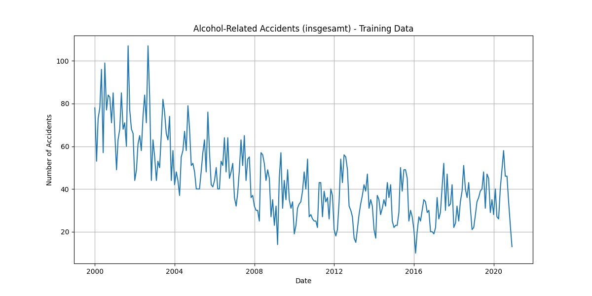
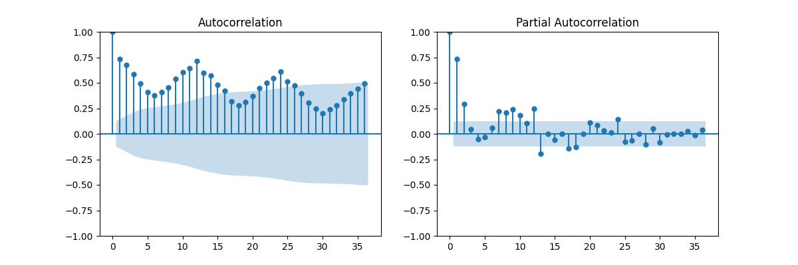
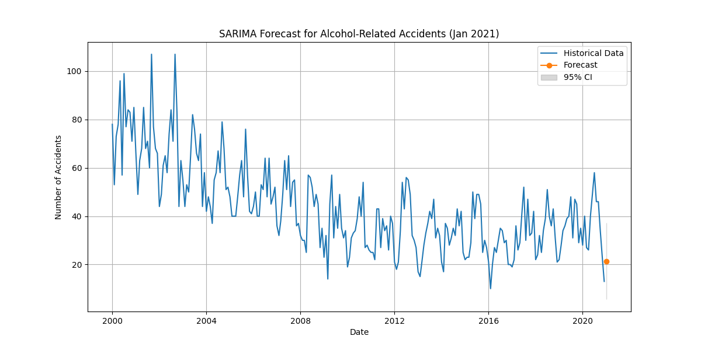

## Files produced by the script
- `filtered_dataset.csv` — filtered timeseries for "Alkoholunfälle" and `Type == 'insgesamt'`.
- `training_dataset.csv` — the training series (up to 2020-12-01) used to fit the model.
- `sarima_alcohol_model.pkl` — the trained SARIMA model serialized with `joblib`.
-  plots — A time series plot, ACF/PACF diagnostics, and a one-step forecast plot are shown by the script.

## Requirements / Environment
- Python 3.8+
- Recommended packages:
  - pandas
  - matplotlib
  - statsmodels
  - joblib
  - 

## Input data
- The script expects the raw dataset at `datasets/c_cleaned.csv`.
- The CSV must contain:
  - A date column named `DATUM` parseable by `pandas.to_datetime`.
  - A `Category` column with values including `Alkoholunfälle`.
  - A `Type` column with a value `insgesamt`.
  - A numeric `Value` column containing monthly counts.

## What the script does 
1. Load `datasets/c_cleaned.csv` and parse dates (`DATUM`) as index.
2. Filter the dataset to `Category == 'Alkoholunfälle'` and `Type == 'insgesamt'`.
3. Sort the index, convert the series to monthly start frequency (`MS`), and split training up to `2020-12-01`.
4. Plot training series and ACF/PACF for visual inspection.
5. Fit a SARIMA(SARIMAX) model:
   - Non-seasonal order: (p, d, q) = (1, 1, 1)
   - Seasonal order: (P, D, Q, s) = (1, 1, 1, 12)
   - enforce_stationarity=False, enforce_invertibility=False
6. Save the fitted model to `sarima_alcohol_model.pkl` using `joblib.dump`.
7. Produce and display a single-step forecast (Jan 2021 in the current script) with a 95% CI.

## Plots
1. Training Data 


2. ACF & PACF 


3. Forecast One Step Ahead



## How to run

```bash
python forecast.py
```
After running:
- Check `filtered_dataset.csv` and `training_dataset.csv` in the working directory.
- `sarima_alcohol_model.pkl` should be created in the working directory.
- Plots will be shown interactively depending on the environment.
